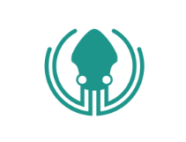

  

# Problem: Environments

- Too many environments
- Wasted resources
- Shared resources become unstable

# Solution: Run dependencies locally 

- Be able to run when debugging
- Set up environments before running solution

# Build a Container with Self-hosted WCF Service

Project WcfServiceConsoleApp is created from Windows Classic Desktop 'Console App' template in Visual Studio. We added a Dockerfile to the project. We use microsoft/dotnet-framework image as the base image and expose ports 80 (for HTTP) and 808 (for NET.TCP) for the container.

Make sure you build project WcfServiceConsoleApp first. Then run commands below to build the container image with name wcfservice:self-hosted and start an instance of it named myservice2.

    C:\wcfapp\WcfServiceConsoleApp>docker build -t wcfservice:self-hosted .

    C:\wcfapp\WcfServiceConsoleApp>docker run -it --rm --name myservice2 wcfservice:self-hosted
The service is ready at http://localhost/Service1.svc
The service is ready at net.tcp://localhost/Service1.svc
The service is running...
Open another console window to find the IP address of the self-hosted WCF service (alternatively, you can run the self-hosted WCF service container in detached mode by docker run -d --name myservice2 wcfservice:self-hosted).

    C:\wcfapp\WcfClientNetCore>docker inspect --format="{{.NetworkSettings.Networks.nat.IPAddress}}" myservice2

172.23.69.75

# SQL as a Container

docker run -d -p 1433:1433 -e sa_password=Alaska2017 -e ACCEPT_EULA=Y microsoft/mssql-server-windows-developer

docker run -d -p 1433:1433 -e sa_password=Alaska2017 -e ACCEPT_EULA=Y -v C:/SQL/:C:/temp/ -e attach_dbs="[{'dbName':'SampleDb','dbFiles':['C:\\temp\\master.mdf','C:\\temp\\master_log. ldf']}]" microsoft/mssql-server-windows-developer

# New Projects

- Create new project
- Add docker support
- Alter compose to include legacy application

# Another solution

- Create a seperate compose file for the external dependancies.

# Shout out:

    https://github.com/Microsoft/dotnet-framework-docker-samples/tree/master/wcfapp
